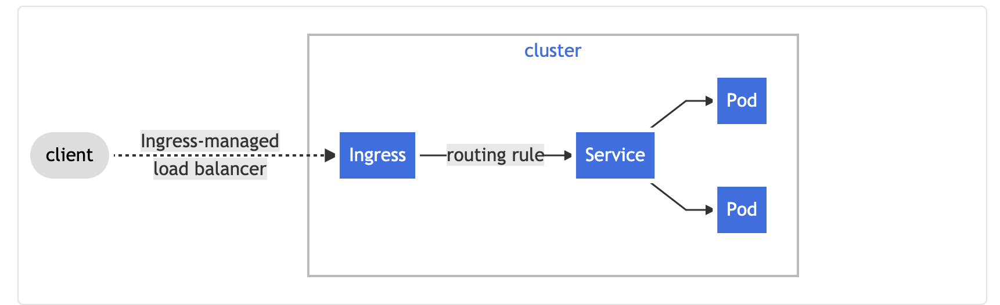

# Ingress Controller
**What is Ingress?**
Ingress exposes HTTP and HTTPS routes from outside the cluster to services within the cluster. Traffic routing is controlled by rules defined on the Ingress resource.

Here is a simple example where an Ingress sends all its traffic to one Service:

An Ingress may be configured to give Services externally-reachable URLs, load balance traffic, terminate SSL / TLS, and offer name-based virtual hosting. An Ingress controller is responsible for fulfilling the Ingress, usually with a load balancer, though it may also configure your edge router or additional frontends to help handle the traffic.
An Ingress does not expose arbitrary ports or protocols. Exposing services other than HTTP and HTTPS to the internet typically uses a service of type Service.Type=NodePort or Service.Type=LoadBalancer.

**Prerequisites:**

You must have an Ingress controller to satisfy an Ingress. Only creating an Ingress resource has no effect.
You may need to deploy an Ingress controller such as ingress-nginx. You can choose from a number of Ingress controllers.
Ideally, all Ingress controllers should fit the reference specification. In reality, the various Ingress controllers operate slightly differently.

**What you will learn in this course**

1-How to create and manage Ingress Controller

2-Setting Up an Ingress Controller on a Cluster
